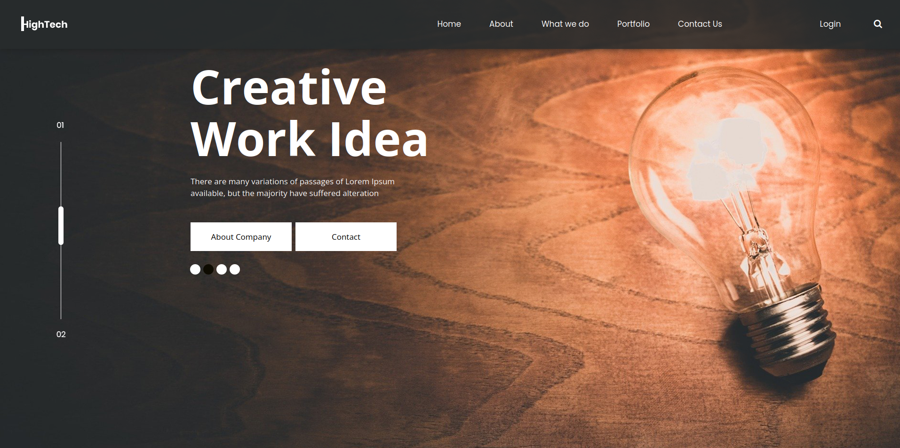

# HighTech Website
## A static website website that is deployed through a Jenkins pipeline on a Kubernetes cluster.  

You can find the website static template at: https://www.free-css.com/free-css-templates/page291/hightech.  
The code for the infrastructure lies in this [repositroy](https://github.com/andrew-anter/hightech-app-Infrastructure/)

<ins>Note:</ins> I am using nginx:alpine image for nginx web server to host the website.

### CI/CD pipeline requirements: (Jenkins pipelins requirements)
1. Dockerhub credentials to be saved to jenkins as a credential of type "username and password" and id "dockerhub-creds"
2. Config file from the GKE cluster to be saved to jenkins as a credential of type "secret file" and id "kubeconfig"
3. Service account with permission "<b>Kubernetes Engine Admin</b>" 
4. In line 36 in [jenkinsfile](./Jenkinsfile) replace "<b>jenkins-auth@hightech-website.iam.gserviceaccount.com</b>" with the sercvice account id and replace "hightech-website" in "--project=<b>hightech-website</b>" with the project id.
5. Service account json key file be uploaded to jenkins as a credentials of type "secret file" and id "gcloud-serviceaccountkey"
<ins><b>Note:</ins></b> The pipeline will runs on agent with label "jenkins-slave"

